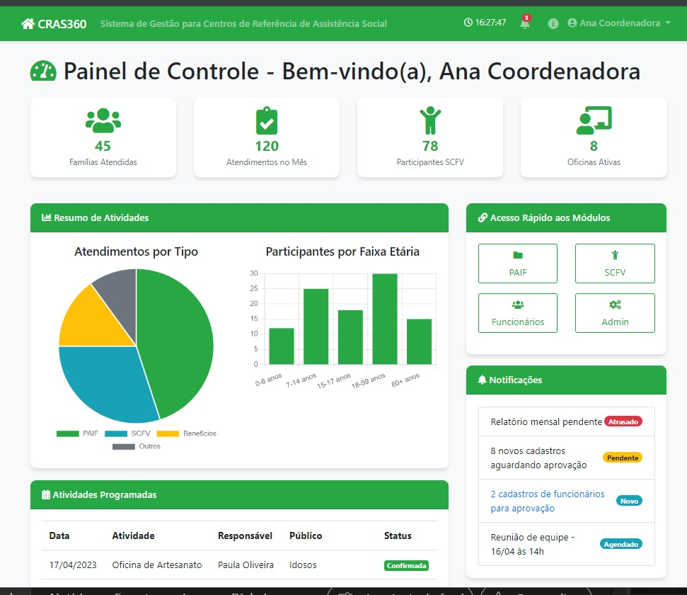
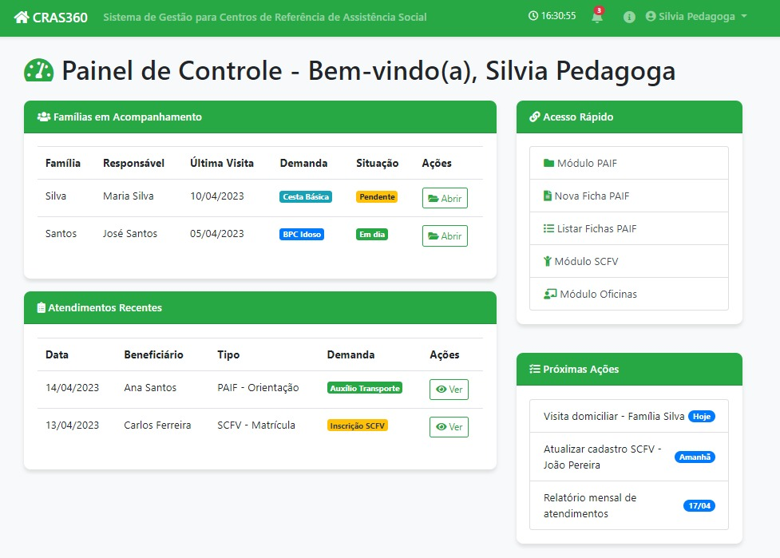
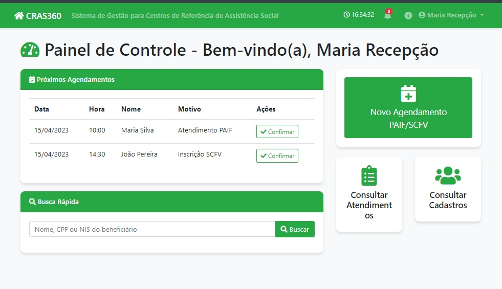
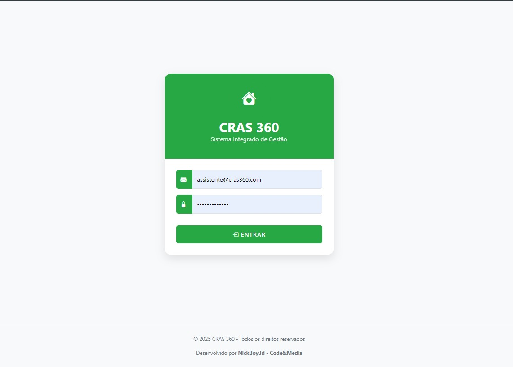

# 🏛️ CRAS360 — Sistema de Gestão Integrado para CRAS

[](https://www.python.org/)
[](https://www.djangoproject.com/)
[](LICENSE)

## 📋 Sobre o Projeto

Sistema web completo para gestão de **Centros de Referência de Assistência Social (CRAS)**, desenvolvido para automatizar e otimizar o atendimento às famílias em situação de vulnerabilidade social.

> **Nota:** Este é um repositório de demonstração criado para fins de portfólio. Dados sensíveis e código proprietário foram removidos ou sanitizados.

### 🎯 Status do Projeto
- **Desenvolvimento:** 80% concluído
- **Tipo:** Repositório público (demo e documentação)
- **Produção:** Código completo em repositório privado

---

## ✨ Funcionalidades Principais

### 👥 Gestão de Beneficiários
- Cadastro completo de famílias e indivíduos
- Registro de composição familiar e dados socioeconômicos
- Validação de CPF e NIS
- Histórico de atendimentos

### 📊 PAIF (Programa de Atenção Integral à Família)
- Registro de fichas PAIF
- Acompanhamento de casos
- Evolução de atendimentos
- Geração de relatórios mensais

### 🎨 SCFV (Serviço de Convivência e Fortalecimento de Vínculos)
- Gestão de oficinas e atividades
- Controle de frequência de participantes
- Organização por faixas etárias
- Relatórios de participação

### 📈 Sistema de Relatórios
- Dashboards interativos com gráficos (Chart.js)
- Mapas de geolocalização (Leaflet)
- Exportação em Excel e PDF
- Relatórios mensais automáticos

### 🔐 Controle de Acesso
- Sistema de autenticação personalizado
- Múltiplos perfis de usuário (Administrador, Gestor, Técnico, Recepção)
- Permissões granulares por módulo
- Logs de auditoria

---

## 🛠️ Stack Tecnológico

### Backend
- **Python 3.9+**
- **Django 4.0** - Framework web principal
- **Django ORM** - Mapeamento objeto-relacional
- **Django Import-Export** - Importação/exportação de dados
- **ReportLab** - Geração de PDFs
- **Pandas** - Manipulação de dados e relatórios

### Frontend
- **HTML5, CSS3, JavaScript (ES6+)**
- **Bootstrap 5** - Framework CSS responsivo
- **Chart.js** - Gráficos interativos
- **Leaflet.js** - Mapas e geolocalização
- **jQuery** - Manipulação do DOM

### Banco de Dados
- **SQLite** (desenvolvimento)
- **PostgreSQL** (produção)

### Outras Ferramentas
- **Pillow** - Processamento de imagens
- **openpyxl / xlrd / xlwt** - Manipulação de arquivos Excel

---

## 🏗️ Arquitetura do Sistema

```
cras360/
├── apps/
│   ├── auth_app/          # Autenticação e usuários
│   ├── core/              # Modelos centrais (Beneficiário, Cidade)
│   ├── paif/              # Gestão PAIF
│   ├── scfv/              # Gestão SCFV
│   ├── relatorios/        # Sistema de relatórios
│   ├── gestao/            # Módulo administrativo
│   ├── recepcao/          # Módulo de recepção
│   └── admin_module/      # Configurações admin
├── cras360/               # Configurações Django
│   ├── settings.py
│   ├── urls.py
│   └── wsgi.py
├── static/                # Arquivos estáticos
│   ├── css/
│   ├── js/
│   └── imagens/
├── templates/             # Templates HTML
│   ├── base.html
│   ├── dashboard.html
│   └── includes/
├── manage.py
└── requirements.txt
```

### Módulos do Sistema

#### 🔑 `auth_app` - Autenticação
- Model customizado de usuário (`Usuario`)
- Vinculação com CRAS específico
- Sistema de grupos e permissões

#### 🗂️ `core` - Núcleo do Sistema
- Model `Beneficiario` com validação de CPF/NIS
- Model `Cidade` para endereçamento
- Middleware personalizado
- Utilitários compartilhados

#### 📋 `paif` - PAIF
- Fichas de atendimento
- Acompanhamento familiar
- Registro de evolução

#### 🎯 `scfv` - SCFV
- Gestão de oficinas
- Controle de frequência
- Atividades por faixa etária

#### 📊 `relatorios` - Relatórios
- Dashboards dinâmicos
- Exportação de dados
- Gráficos e visualizações

---

## 🚀 Como Executar Localmente

### Pré-requisitos
- Python 3.9 ou superior
- pip (gerenciador de pacotes Python)
- Git

### Instalação

```bash
# Clone o repositório
git clone https://github.com/NickBoyCodeMedia/CRAS360-public.git
cd CRAS360-public

# Crie um ambiente virtual
python -m venv venv

# Ative o ambiente virtual
# Windows:
.\venv\Scripts\activate
# Linux/Mac:
source venv/bin/activate

# Instale as dependências
pip install -r requirements.txt

# Execute as migrações
python manage.py migrate

# Crie um superusuário
python manage.py createsuperuser

# Execute o servidor de desenvolvimento
python manage.py runserver
```

Acesse: `http://127.0.0.1:8000`

---

## 📸 Screenshots

### 🏠 Dashboard - Coordenação

*Interface de coordenação com visão geral dos atendimentos e estatísticas consolidadas*

### 📊 Dashboard - Pedagógico

*Painel pedagógico com acompanhamento de atividades e participantes do SCFV*

### 📋 Dashboard - Recepção

*Interface de recepção para registro inicial de atendimentos e triagem*

### 🔐 Tela de Login

*Sistema de autenticação com controle de acesso por perfil de usuário*

> **💡 Observação:** Todas as telas foram desenvolvidas com design responsivo utilizando Bootstrap 5 e incluem dashboards interativos com Chart.js e Leaflet para visualização de dados geográficos.

---

## 🔒 Segurança e Privacidade

- ✅ SECRET_KEY alterada para versão demo
- ✅ Dados sensíveis removidos
- ✅ Validação de formulários e sanitização de inputs
- ✅ Proteção CSRF habilitada
- ✅ Sistema de permissões robusto

---

## 📝 Licença

Este é um projeto de demonstração para fins de portfólio. Não é permitido o uso comercial sem autorização.

---

## 👨‍💻 Desenvolvedor

**Nick Boy** - [GitHub](https://github.com/NickBoyCodeMedia)

---

## 📞 Contato

Para mais informações sobre este projeto ou oportunidades profissionais, entre em contato através do GitHub.

---

**Desenvolvido com ❤️ usando Django e Python**
